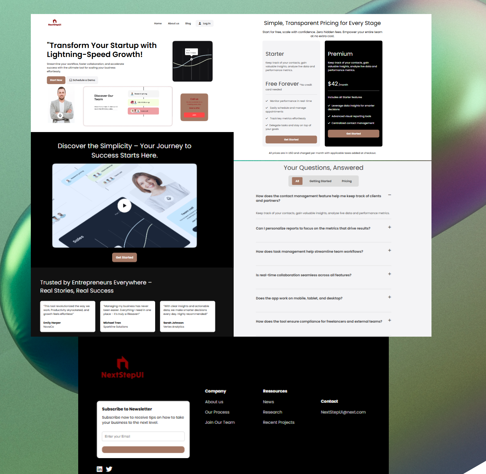

# NextStepUI

**NextStepUI** is a modern, responsive frontend template designed for startups and businesses to streamline workflows, enhance collaboration, and scale effectively. This project includes interactive elements such as pricing plans, FAQs, testimonials, and a visually appealing hero section.

---

## **Live Preview**
A live version of the project can be hosted on GitHub Pages or other platforms.  

---

## **Features**
- **Hero Section**: Catchy tagline and call-to-action buttons to drive user engagement.
- **Video Section**: Interactive video preview to demonstrate product functionality.
- **Pricing Plans**: Transparent pricing details with a starter and premium plan.
- **Testimonials**: Feedback from trusted users to build credibility.
- **FAQs Section**: Answers to frequently asked questions to address user concerns.
- **Footer**: Informative footer with contact details, company information, and a subscription form.

---

## **Technologies Used**
- **HTML5**: Semantic markup for better accessibility.
- **CSS3**: Custom styles for responsiveness and design.
- **Font Awesome**: Icons for visual appeal and functionality.
- **Google Fonts**: Poppins font for a clean and modern look.

---

## **Folder Structure**
```plaintext
|-- index.html          // Main HTML file
|-- css/
|   |-- style.css       // Custom styles
|-- js/
|   |-- main.js         // JavaScript functionalities
|-- images/
|   |-- favicon.ico     // Favicon
|   |-- nextsteplogo.png // Header logo
|   |-- logofooter.png   // Footer logo
|   |-- video-preview.png // Video section thumbnail
```

---

## **How to Run Locally**
1. Clone the repository:
   ```bash
   git clone https://github.com/RAZIMOUAD/NextStepUI.git
   ```
2. Navigate to the project directory:
   ```bash
   cd NextStepUI
   ```
3. Open `index.html` in your preferred browser.

---

## **Customization**
### **Logos**
- Replace `nextsteplogo.png` and `logofooter.png` in the `images/` folder to personalize the branding.
  
### **Colors**
- Modify the color scheme by editing variables in the `style.css` file.

### **Content**
- Update texts and sections in `index.html` to reflect your branding and business needs.

---

## **Future Improvements**
- Add backend integration for subscription forms.
- Include animations for smoother user interactions.
- Optimize images for faster load times.

---

## **Screenshots**


---

## **License**
This project is open source and available under the MIT License. Feel free to use and adapt it for personal or commercial purposes.


---

## **Acknowledgments**
Special thanks to resources like [Font Awesome](https://fontawesome.com/) and [Google Fonts](https://fonts.google.com/) for enhancing the visual design of this project.
